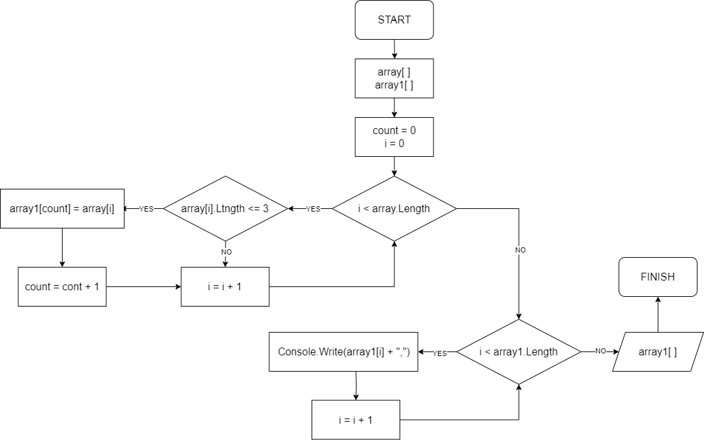
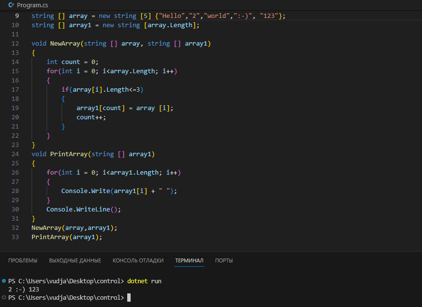

# Контрольная работа по итогу 1го блока
1. Создать репозиторий на GitHub
2. Нарисовать блок-схему алгоритма (можно обойтись блок-схемой основной содержательной части, если вы выделяете её в отдельный метод)
3. Снабдить репозиторий оформленным текстовым описанием решения (файл README.md)
4. Написать программу, решающую поставленную задачу
5. Использовать контроль версий в работе над этим небольшим проектом (не должно быть так, что всё залито одним коммитом, как минимум этапы 2, 3, и 4 должны быть расположены в разных коммитах)

*Задача*: Написать программу, которая из имеющегося массива строк формирует новый массив из строк, длина которых меньше, либо равна 3 символам. Первоначальный массив можно ввести с клавиатуры, либо задать на старте выполнения алгоритма. При решении не рекомендуется пользоваться коллекциями, лучше обойтись исключительно массивами.

*Примеры:
[“Hello”, “2”, “world”, “:-)”] → [“2”, “:-)”]
[“1234”, “1567”, “-2”, “computer science”] → [“-2”]
[“Russia”, “Denmark”, “Kazan”] → []*

## Выполнение вышеуказанных заданий

- Создан [репозиторий](https://github.com/vudjaaz/Control) на сайте [GitHub](https://github.com/)
- Нарисована блок-схема на сайте [drawio](https://www.drawio.com/)

- Решение задачи 

- Описание решении задачи:
1) Создаем два массивы с типом данных string. Второй массив будет служить для записи в него результата после вызова метода.
2) Создаем первый метод, который будет проходить по всем индексам первого массива и согласно заданному условию, будет проверять и выписывать индексы во второй массив, длина символов которых меньше или равно трем. 
3) Результат первого метода хранится во втором массиве. Для того чтобы его вывести на экран нужно создать еще один метод, в котором также заданный цикл пройдется по всей длине второго массива.
4) После создания двух методов, нужно вызвать их на экран. Ответ получен.